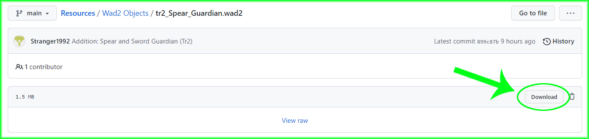

# Instructions:
- Open the desired file.
- Press the download button located in the new page.

- You can import to your Tomb Editor level with the option in "Tools > Level Setting > Object Files".
- You can also use Wad Tool to include them in your wad2 pack.
- No credit is required for these objects.

# Gallery:
### Enemies
           

### Objects
  

# Descriptions.
### TR1 Big Rat
- Minimum required version: TEN 1.0.6
- Combined the animations of Land and Water rats, applied the new states. 
- I had to add sounds manually to the water animations for this object version.
### TR2 Jade Warriors
- Minimum required version: TEN 1.0.7
### TR3 Cobras
- Minimum required version: TEN 1.0.1
- Fixed the death state of animation 4, setting state from 0 to 4 to avoid it getting freeze on death.
### TR3 Puna & Lizard
- Minimum required version: TEN 1.0.6
- Provided special effects for shield and death explossion.
### TR3 Sophia Leigh
- Minimum required version: TEN 1.0.7
- Provided special effects for shield and death explossion.
- Provided edited ENERGY_BUBBLES which includes proyectiles for Sophia
        
    **OCB**
    - 0: Classic enemy behaviour
    - 1: Tower mode. (TR3 behaviour)
    - 2: Tower mode with lua
### TR3 Mutant Wasp
- Minimum required version: TEN 1.0.8
### TR3 Shiva
- Minimum required version: TEN 1.0.1
- Statue material updated with specular effect
### TR3 Willard
- Minimum required version: WIP
### TR4 Baboons
- Minimum required version: TEN 1.0.1
- Fixed invisible baboon material so it can cast its specular shine despite its invisible colors.
- Cloned normal baboon animations on invisible and silent baboons. (Required fix after 1.0.6).
### TR4 Jackals
- Minimum required version: TEN 1.0.1
- Fixed the animation 10 to can manage the a State 12, allowing it to return animation 23.
    
    **OCB**
    - 0: Normal behaviour
    - 1: Jackals start laying down like statues, enable by trigger for them "wake up"
### TR5 Imps
- Minimum required version: TEN 1.0.8

### TR5 Swats
- Minimum required version: TEN 1.0.1
- Fixed the shooting animation
- Animations cloned to the secondary swat. (Required fix after 1.0.6).
 ### TR5 VCI guard
 - Minimum required version: TEN 1.0.1
 - Fixed the shooting animation
### TR1 Slamming Doors
- Minimum required version: TEN 1.0.8
### TR3 Slamming Doors
- Minimum required version: TEN 1.0.8
- Fixed animations order and states to produce smooth transitions between activation and deactivation
### TR5 Robot Claw
- Minimum required version: WIP
