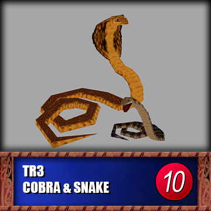

# Instructions:
- Download the desired wad2 pressing the right button of the mouse on them and selecting the download link source option.
- You can import to your Tomb Editor level with the option in "Tools > Level Setting > Object Files".
- You can also use Wad Tool to include them in your wad2 pack.
- No credit to me is required for these objects.

# Historial:
- Added TR3 Sophia
- Added TR3 Puna and Lizard
- Added TR1 big rat
- Added TR4 jackals
- Added TR3 cobras

# Gallery:
    

# Descriptions.
### TR1 Big Rat
    TEN 1.0.6
    Combined the animations of Land and Water rats, applied the new states. 
	I had to add sounds manually to the water animations for this object version.
    In TEN version 1.0.6 (unreleased yet) fixs the bug that crashes the game when big rats are killed.
### TR3 Cobras
    TEN 1.0.1
    Fixed the death state of animation 4, setting state from 0 to 4 to avoid it getting freeze on death.
### TR3 Puna & Lizard
    TEN 1.0.6
    Provided special effects for shield and death explossion.
### TR3 Sophia Leight
    TEN 1.0.7
    Provided special effects for shield and death explossion.
    Provided edited ENERGY_BUBBLES which includes proyectiles for Sophia
        
    **OCB**
    - 0: Classic enemy behaviour
    - 1: Tower mode. (TR3 behaviour)
    - 2: Tower mode with lua
### TR4 Jackals
    TEN 1.0.1
    Fixed the animation 10 to can manage the a State 12, allowing it to return animation 23.
    
    **OCB**
    - 0: Normal behaviour
    - 1: Jackals start laying down like statues, enable by trigger for them "wake up"

    
